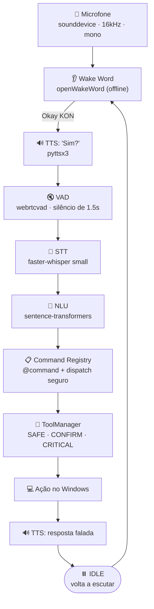

<div align="center">

# 🌌 KON

### Assistente pessoal por voz para Windows

Inspirado no conceito do JARVIS, o **KON** escuta, entende e executa comandos **100% por voz**, de forma contínua, offline e sem nenhum botão.

<p>
  
  
  
  
  
  
</p>

</div>

---

## 📖 Sobre o projeto

O **KON** é um assistente pessoal inteligente desenvolvido para Windows. No **Marco 2**, o subsistema de voz foi completamente refatorado para operar de forma **real, contínua e 100% por voz**.

> 💡 **Nenhum botão é necessário para utilizar o KON.**
> Ao iniciar, o microfone entra em captura contínua e fica escutando a wake word **"Okay KON"**. A interface em React funciona apenas como um **Monitor Visual HUD** em tempo real.

### ✨ Destaques

- 🎙️ **Escuta contínua** com captura de áudio em thread isolada (16 kHz, mono)
- 🗣️ **Wake word offline** ("Okay KON") com openWakeWord
- 🔇 **Detecção de fala (VAD)** com encerramento automático após 1,5 s de silêncio
- 📝 **Transcrição local** com faster-whisper (modelo `small`, CPU, int8, pt)
- 🧠 **NLU semântico multilíngue** com sentence-transformers e similaridade de cosseno
- 🔐 **Execução segura**: registry de comandos sem `eval`/`exec` e níveis de permissão `SAFE`, `CONFIRM` e `CRITICAL`
- 🔊 **Resposta falada** em português brasileiro (voz Microsoft Maria) em thread não-bloqueante
- 🖥️ **HUD em tempo real** via WebSocket (React 19 + Vite)

---

## 🏛️ Pipeline de voz



---

## 📁 Estrutura do projeto

```
KON/
├── main.py                     # Ponto de entrada: inicia servidor e voz contínua
├── INICIAR_KON.bat             # Inicializador (backend + frontend + navegador)
├── requirements.txt            # Dependências do Python
│
├── voice_assistant/            # Subsistema de voz (Marco 2)
│   ├── audio/                  # capture.py · vad.py · wake_word.py
│   ├── stt/                    # whisper_engine.py
│   ├── nlu/                    # intent_parser.py
│   ├── commands/               # registry.py · system_commands.py · media_commands.py
│   ├── tts/                    # speak.py
│   └── core/                   # state_machine.py (VoicePipelineOrchestrator)
│
├── backend/                    # Núcleo do sistema (Marco 1)
│   ├── core/                   # KONCore, estados, EventBus, config, logger
│   ├── ai/                     # ToolManager e níveis de permissão
│   ├── computer/               # Integração segura com o Windows
│   ├── memory/                 # Persistência SQLite local
│   └── server/                 # FastAPI REST + WebSocket (/ws)
│
├── frontend/                   # Monitor Visual HUD (React 19 + Vite)
├── data/models/                # Modelos ONNX locais e banco kon.db
└── tests/                      # Testes automatizados (Marco 1 e Marco 2)
```

---

## ⚙️ Pré-requisitos

| Item | Requisito |
|------|-----------|
| **Sistema operacional** | Windows 10 ou 11 (64-bit) |
| **Python** | 3.12 ou superior |
| **Node.js** | 18 ou superior (interface React) |
| **Microfone** | Dispositivo de entrada padrão configurado no Windows |
| **Memória RAM** | Mínimo de 8 GB |

---

## 📦 Instalação

**1. Acesse o repositório**

```powershell
git clone https://github.com/GbielDEV/KON.git
cd KON
```

**2. Crie e ative o ambiente virtual**

```powershell
uv venv
# ou: python -m venv .venv

.\.venv\Scripts\Activate.ps1
```

**3. Instale as dependências do Python**

```powershell
uv pip install -r requirements.txt
# ou: pip install -r requirements.txt
```

**4. Instale as dependências do frontend**

```powershell
cd frontend
npm install
cd ..
```

---

## 🚀 Como executar

**Somente o assistente (backend + voz):**

```powershell
python main.py
```

O KON conecta o microfone, entra em `[STATE] IDLE` escutando a wake word e sobe o servidor local em `http://127.0.0.1:8000`.

**Completo, com o Monitor Visual React:**

Dê um duplo clique em `INICIAR_KON.bat`. Ele inicia o backend com a voz ativa, o servidor do Vite e abre o navegador em `http://127.0.0.1:5173`.

---

## 🎙️ Testando por voz

1. Não clique em nenhum botão.
2. Diga **"Okay KON"** perto do microfone.
3. O KON responde **"Sim?"**
4. Diga o comando, por exemplo **"abrir navegador"**.

Exemplo do que aparece no terminal:

```
[WAKE] Wake word detectada! Disparando ciclo de voz...
[STATE] OUVINDO
[TTS] Resposta: "Sim?"
[VAD] Início da fala detectado!
[VAD] Fim da fala (silêncio de 1.5s detectado).
[STATE] PROCESSANDO
[STT] Texto: "abrir navegador"
[NLU] Intent: abrir_navegador (confiança: 1.000 >= 0.55)
[STATE] EXECUTING
[COMMAND] Executando abrir_navegador
[STATE] SPEAKING
[TTS] Resposta: "Abrindo o navegador."
[STATE] IDLE
```

### Comandos disponíveis

| Comando | Exemplo de fala |
|---------|-----------------|
| `abrir_navegador` | "abrir navegador" |
| `informar_horario` | "que horas são" |
| `abrir_pasta` | "abrir pasta" |
| `tocar_musica` | "tocar música" |

---

## 🧪 Testes e diagnóstico

<details>
<summary><b>Testar o microfone</b></summary>

```powershell
uv run python -c "from voice_assistant.audio.capture import AudioCapture; cap = AudioCapture(); print('Microfone:', cap.get_device_name(), '| Disponível:', cap.is_available())"
```
</details>

<details>
<summary><b>Testar a wake word</b></summary>

```powershell
uv run python -c "from voice_assistant.audio.wake_word import OpenWakeWordDetector; d = OpenWakeWordDetector(); d.start(); print('Detector ativo:', d.is_active(), '| Modelos:', d._active_models); d.stop()"
```
</details>

<details>
<summary><b>Testar o STT (Whisper small)</b></summary>

```powershell
uv run python -c "from voice_assistant.stt.whisper_engine import WhisperSTTEngine; stt = WhisperSTTEngine(model_size='small'); print('Whisper small pronto!')"
```
</details>

<details>
<summary><b>Testar o NLU</b></summary>

```powershell
uv run python -c "from voice_assistant.nlu.intent_parser import IntentParser; p = IntentParser(); print('abrir navegador ->', p.resolver_intent('abrir navegador')); print('que horas são ->', p.resolver_intent('que horas são'))"
```
</details>

**Rodar todos os testes automatizados (27 testes):**

```powershell
uv run python -m pytest -v
```

---

## 🛠️ Solução de problemas

<details>
<summary><b>Microfone não detectado</b></summary>

Verifique nas configurações do Windows se o microfone é o dispositivo padrão e se o acesso ao microfone está liberado para aplicativos.
</details>

<details>
<summary><b>Whisper demora na primeira execução</b></summary>

Na primeira vez, o modelo `small` (~460 MB) é baixado e guardado em cache em `.cache/huggingface/hub`. Nas próximas execuções, o carregamento é rápido.
</details>

<details>
<summary><b>Voz em português do Brasil</b></summary>

O KON seleciona automaticamente a voz `Microsoft Maria Desktop - Portuguese(Brazil)`. Se nenhuma voz pt-BR estiver instalada, ele usa a voz padrão do sistema.
</details>

---

## 👨‍💻 Autor

Desenvolvido por **Gabriel Madureira**.

<p>
  <a href="https://github.com/GbielDEV"></a>
  <a href="https://www.linkedin.com/in/gbieldev/"></a>
  <a href="https://www.instagram.com/g.madureiras/"></a>
</p>
